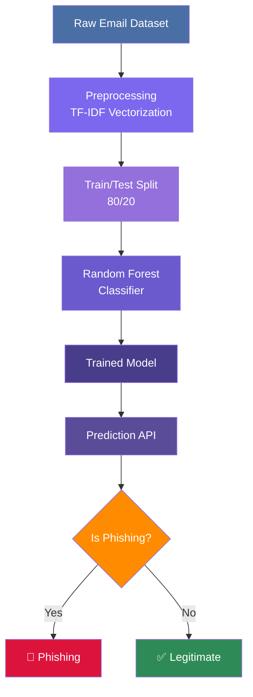
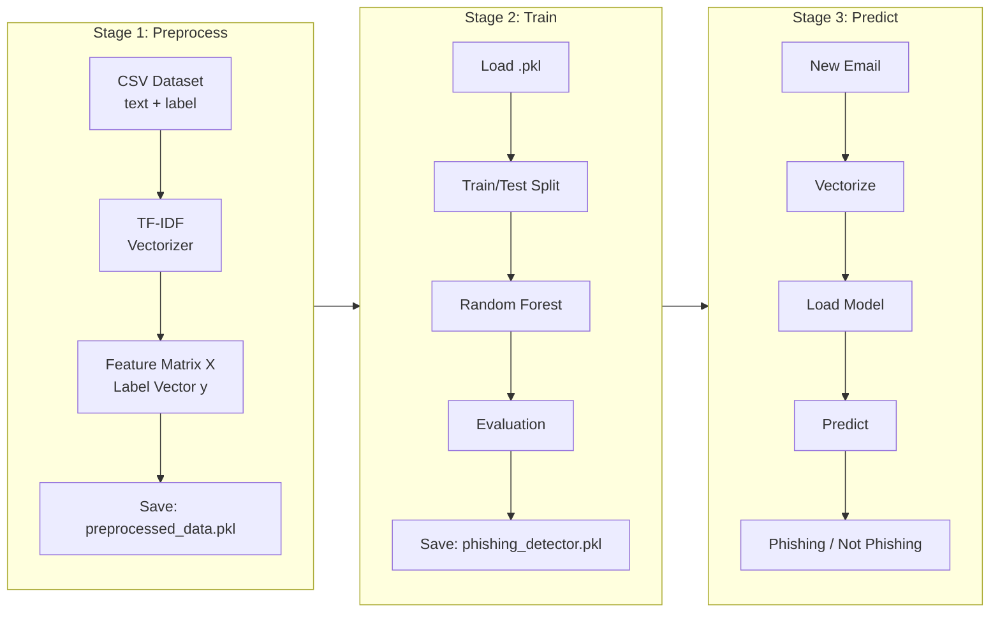
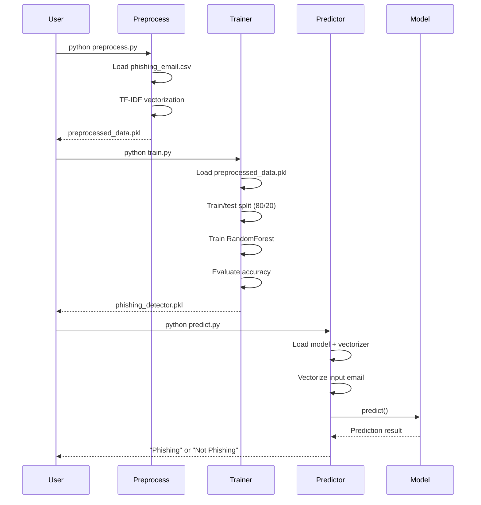
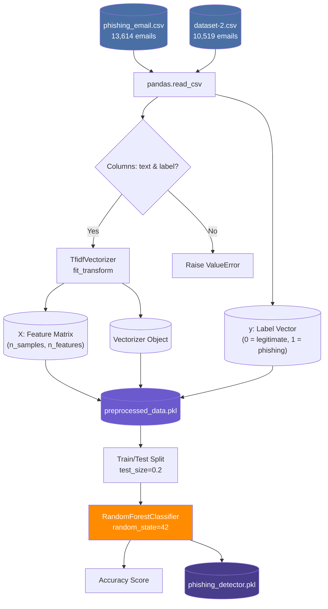
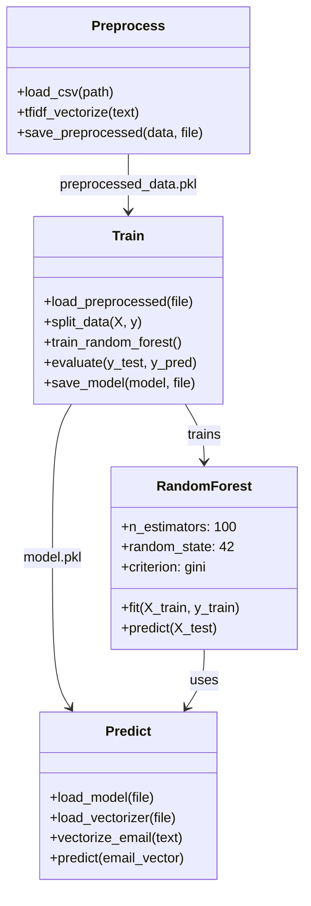
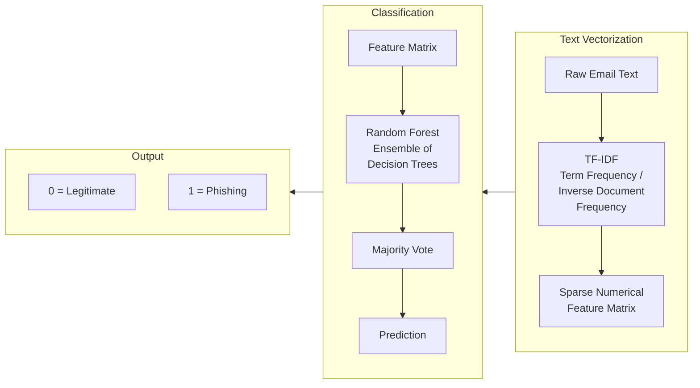

# Phishing Email Classification

A machine learning pipeline to classify emails as **phishing** or **legitimate** using TF-IDF vectorization and a Random Forest classifier.



## Project Pipeline

The project follows a three-stage pipeline:



## Workflow



## Data Flow



## Model Architecture



## Files

| File | Purpose |
|------|---------|
| `preprocess.py` | Loads CSV, vectorizes text with TF-IDF, saves preprocessed data |
| `train.py` | Loads preprocessed data, trains RandomForest, evaluates, saves model |
| `predict.py` | Loads saved model, vectorizes input, predicts phishing/legitimate |
| `phishing_email.csv` | Primary dataset (13,614 emails) |
| `dataset-2.csv` | Secondary dataset (10,519 emails) |
| `Pipfile` | Python 3.12 dependency specification |

## Installation

```bash
pip install pandas scikit-learn
```

Or using Pipenv:

```bash
pipenv install
pipenv shell
```

## Usage

### 1. Preprocess the data

```bash
python preprocess.py
```

Output: `preprocessed_data.pkl` containing the TF-IDF feature matrix, label vector, and vectorizer.

### 2. Train the model

```bash
python train.py
```

Output: Trained `phishing_detector.pkl` with accuracy printed to console.

### 3. Make predictions

```bash
python predict.py
```

The script includes a sample prediction. Modify `email_text` in `predict.py` to classify custom emails.

## How It Works



## Dataset Format

The CSV files must contain two columns:

```
text,label
"Your account has been compromised...",1
"Meeting scheduled for tomorrow",0
```

- **text**: Email body content
- **label**: 0 for legitimate, 1 for phishing

## License

MIT License — see [LICENSE](LICENSE).
